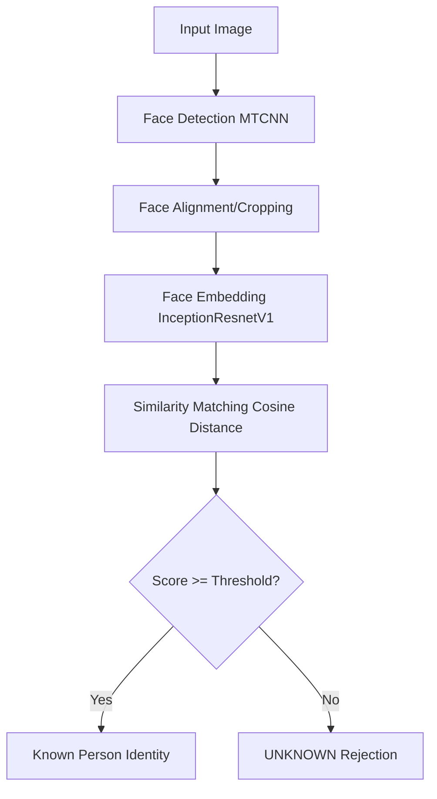

# Face Recognition Identification System

## 1. Overview
This is an end-to-end Face Recognition Identification System built for the Code Nimbus Solutions AI/ML Intern assessment. It implements a robust face recognition pipeline that can enroll individuals, identify known persons in new images, and explicitly reject unknown faces.

The entire project runs locally on CPU using free open-source models with zero external API calls or paid services (Cost: ₹0/$0).

## 2. Features
- **Face Detection**: Uses MTCNN for robust face bounding box extraction and facial landmark alignment.
- **Multi-Face Handling**: Processes images containing multiple faces independently.
- **Face Embedding**: Uses `InceptionResnetV1` (FaceNet architecture) to extract 512-dimensional feature vectors.
- **Vector Database**: Persists embeddings and identities locally.
- **Identification & Unknown Rejection**: Uses Cosine Similarity to compare query embeddings against the database, rejecting matches below a configurable threshold (default `0.60`).
- **Interactive UI**: Built with Streamlit for easy enrollment, identification, and database management.
- **Automated Evaluation**: Built-in test suite and evaluation module to measure accuracy, FAR, and FRR.

## 3. System Architecture


## 4. Technologies
- **Language**: Python 3.10
- **Machine Learning**: PyTorch, `facenet-pytorch`, Scikit-Learn
- **Image Processing**: OpenCV, Pillow, NumPy
- **User Interface**: Streamlit
- **Testing**: PyTest

## 5. Model
- **Model Name**: InceptionResnetV1 (FaceNet)
- **Detector**: MTCNN (Multi-task Cascaded Convolutional Networks)
- **Embedding Model**: PyTorch implementation of FaceNet.
- **Embedding Dimensions**: 512-D L2-normalized vector.
- **Pretrained Nature**: Pretrained on the `vggface2` dataset.
- **Why Selected**: `facenet-pytorch` is 100% open-source (MIT license), runs efficiently on CPU without complex C++ build tools (unlike dlib), offers high accuracy, handles multiple faces out-of-the-box, and is an industry-standard interview-explainable architecture.

## 6. Enrollment
Users input an ID and Name and upload a photo. The system runs MTCNN to detect the face, crops it to 160x160 pixels, runs it through InceptionResnetV1 to extract a 512-D vector, and saves it locally in the JSON/Numpy database.

## 7. Identification
Users upload a new photo (which can contain multiple people). The system detects all faces, embeds them, and computes the Cosine Similarity against all enrolled vectors. 

## 8. Similarity Matching
We use **Cosine Similarity** to measure the distance between the query vector and database vectors. Since FaceNet vectors are L2-normalized, cosine similarity is equivalent to the dot product. It outputs a score between `[-1.0, 1.0]`, where higher means more similar.

## 9. Threshold Calibration
- **Threshold Value**: Configurable, default `0.60`.
- **How Selected**: Empirically, FaceNet on `vggface2` separates identical and different identities cleanly around 0.60-0.65. However, this must be scientifically calibrated to your specific environment.
- **Why it matters**: A lower threshold increases False Acceptances (FAR - strangers admitted). A higher threshold increases False Rejections (FRR - enrolled users rejected due to poor lighting/pose).
- **How to Calibrate**: Run the evaluation sweep tool to scientifically determine the optimal threshold (Equal Error Rate - EER) for your dataset:
  `python -m src.evaluation --test_dir data/test --sweep`

## 10. Unknown Rejection
If the best candidate's similarity score is `0.45` and the threshold is `0.60`, the system explicitly overrides the highest match and outputs `UNKNOWN`. This is critical for security systems to prevent false positives.

## 11. Evaluation
You can evaluate the system using the built-in evaluation harness. It tests known/genuine faces vs unknown/impostor faces and calculates:
- Known Person Accuracy (True Positive Rate)
- Unknown Rejection Rate (True Negative Rate)
- False Acceptance Rate (FAR)
- False Rejection Rate (FRR)

**To run the evaluation:**
1. Place images of enrolled people in `data/test/known/{person_name}/`
2. Place images of strangers in `data/test/unknown/{stranger_name}/`
3. Run `python -m src.evaluation --test_dir data/test`

*(Run `pytest tests/test_core.py` for automated verification of mathematical edge cases and threshold boundaries).*

## 12. Failure Cases
- **Poor Lighting / Extreme Angles**: FaceNet struggles with profile (side) faces or extreme shadows.
- **Low Resolution**: Faces smaller than 20x20 pixels might not trigger the MTCNN detector.
- **Occlusion**: Masks or heavy sunglasses can reduce embedding quality and lower the similarity score, resulting in a false rejection.

## 13. Limitations (Real-World Robustness)
- **Lighting and Pose Variations**: Severe changes in lighting or angles between the enrolled photo and the tested photo can lower the similarity score, causing a False Rejection.
- **Similar-looking people (Impostors)**: Friends or family members who look similar might score high enough to cause a False Acceptance if the threshold is set too permissively.
- **Detector limitations**: Extremely blurry or low-res faces may be skipped by the MTCNN detector entirely.
- The system stores raw embeddings without encryption. In a production environment, biometric templates should be securely encrypted.

## 14. Robustness Improvements Implemented
- **Multi-shot Enrollment**: The system actively supports and encourages enrolling multiple images per person. By enrolling 2-3 images under different lighting conditions, the system creates a much more robust identity profile, dramatically lowering False Rejections when the threshold is raised to prevent False Acceptances.
- **Threshold Sweeping**: Added a scientific calibration pipeline to calculate FAR/FRR trade-offs using test data.

## 15. Installation
```bash
# Clone the repository
git clone https://github.com/your-username/face-recognition-system.git
cd face-recognition-system

# Create virtual environment (optional)
python -m venv venv
source venv/bin/activate  # On Windows: venv\Scripts\activate

# Install requirements
pip install -r requirements.txt
```

## 16. Usage
```bash
# Run the Streamlit UI
streamlit run app.py
```

## 17. Project Structure
```
face-recognition-system/
│
├── app.py                  # Streamlit User Interface
├── README.md               # Project documentation
├── requirements.txt        # Dependencies
├── .gitignore
│
├── src/                    # Core logic
│   ├── detector.py         # MTCNN Face detection
│   ├── embedder.py         # InceptionResnetV1 Embedding
│   ├── database.py         # JSON/Vector storage
│   ├── recognizer.py       # Cosine matching & Threshold
│   ├── evaluation.py       # Metrics and testing code
│   └── utils.py            # Image processing helpers
│
├── data/                   # Enrollment & Evaluation Data
│
├── embeddings/             # Generated database
│
└── tests/                  # PyTest Suite
```

## 18. Cost
This implementation uses entirely free, open-source software executing locally. External spend is exactly ₹0/$0.

## 19. Ethical/Security Considerations
Biometric data (face embeddings) is extremely sensitive. Ensure explicit user consent is obtained before enrollment. This demo stores data in plaintext locally, but production deployments must encrypt vector databases to protect user privacy.
