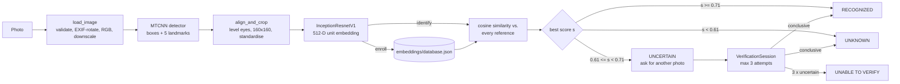
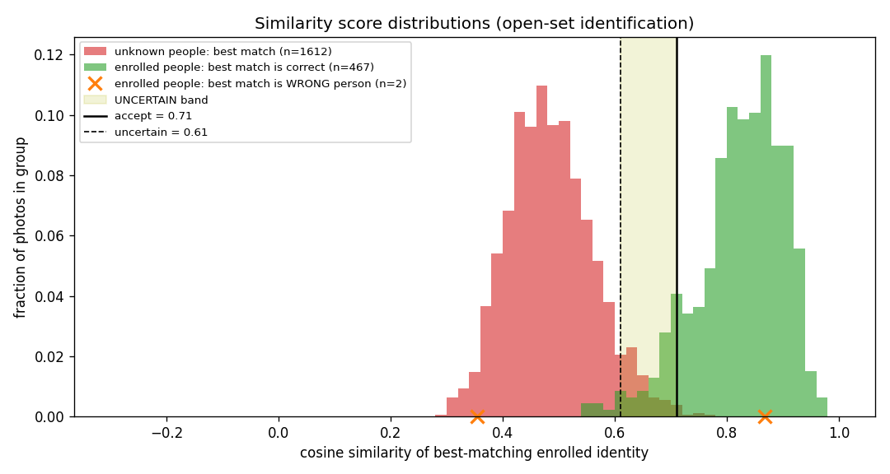
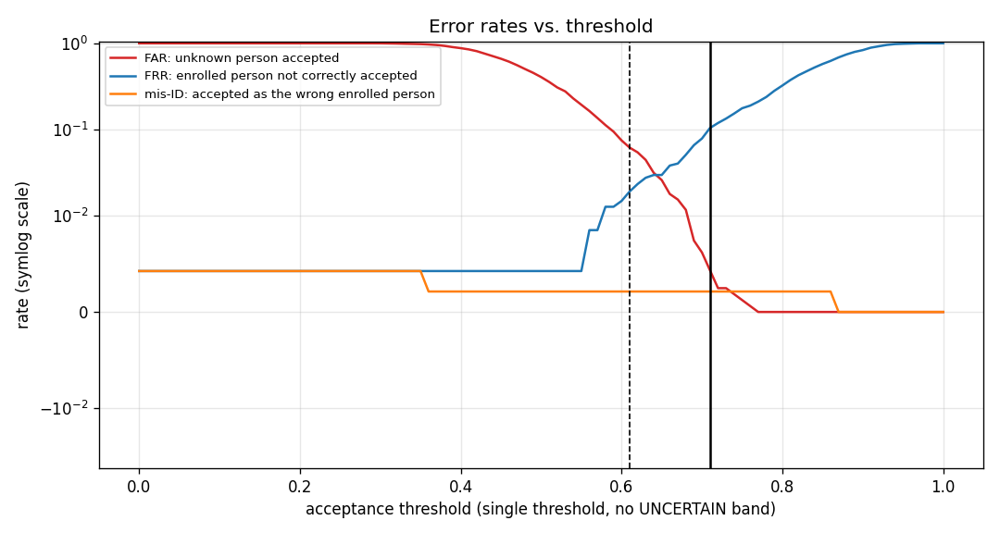

# Face Recognition Identification System

Enroll people from photos, then identify faces in new photos by matching them against the enrolled
database. The system rejects people who are not enrolled (**UNKNOWN**), handles borderline scores
safely with an **UNCERTAIN** state and bounded re-verification, and ships with a reproducible
evaluation on real data. It is free, open-source, and runs locally on a CPU.

> Built for the Code Nimbus Solutions AI/ML internship assignment.
> **Cost: ₹0 / $0.** No paid APIs, no cloud services, no credit card.

---

## 1. Overview

| Question | Component | Answer |
|---|---|---|
| *Where are the faces?* | Face **detection**: MTCNN | Boxes + 5 landmarks for every face |
| *Whose face is this?* | Face **recognition**: FaceNet embeddings + cosine similarity + decision policy | RECOGNIZED / UNCERTAIN / UNKNOWN |

Two workflows:

```
ENROLLMENT      photo(s) -> detect -> align/crop -> FaceNet -> 512-D embedding -> quality & duplicate checks -> store
IDENTIFICATION  photo    -> detect -> align/crop -> FaceNet -> 512-D embedding -> cosine similarity vs. all
                references -> best candidate -> decision policy -> RECOGNIZED / UNCERTAIN / UNKNOWN
```

## 2. Features

- Face detection with **MTCNN**, which handles **multiple faces per image**
- Landmark-based **alignment** (eyes levelled) and a 160×160 crop
- Pretrained **FaceNet (InceptionResnetV1, VGGFace2)** 512-D embeddings, L2-normalised
- **Multi-photo enrollment** with quality gates (face size, blur, lighting, detection confidence), duplicate-photo detection, a same-person consistency check, and a one-person-one-ID check
- **Cosine similarity**, vectorised against every stored reference embedding
- Three-state decision: **RECOGNIZED / UNCERTAIN / UNKNOWN**. The closest person is never accepted just for being closest
- **Bounded re-verification** of UNCERTAIN results (default max **3** attempts, then **UNABLE TO VERIFY**)
- Thresholds **calibrated on data** (LFW validation split) and **reported on different people** (LFW test split)
- Persistent JSON database with atomic writes, validation, model/version checks, and corrupt-file protection
- Streamlit UI: Enroll · Identify (with re-verification) · Enrolled People · Evaluation
- 81 automated tests (71 unit + 10 integration with the real models)

## 3. Architecture



| Module | Responsibility |
|---|---|
| `src/config.py` | Every threshold and setting in one place |
| `src/utils.py` | Image loading/validation, alignment + crop, quality metrics, drawing |
| `src/detector.py` | MTCNN face detection → `DetectedFace` |
| `src/embedder.py` | FaceNet embeddings (batched, validated) |
| `src/database.py` | Persistent identity/embedding store |
| `src/recognizer.py` | Cosine similarity, best match, decision policy |
| `src/verification.py` | Bounded re-verification state machine |
| `src/pipeline.py` | End-to-end enrollment and identification (used by the app, the evaluation and the tests) |
| `src/evaluation.py` | Open-set evaluation, threshold calibration, session simulation |
| `app.py` | Streamlit UI |

## 4. Technologies

Python 3.10 · PyTorch 2.2 (CPU) · facenet-pytorch 2.6 · OpenCV 4.11 · Pillow · NumPy · Streamlit 1.56 ·
pandas · matplotlib · pytest. All free and open source.

## 5. Model

| Item | Value |
|---|---|
| Library | [`facenet-pytorch`](https://github.com/timesler/facenet-pytorch) 2.6.0 (MIT licence) |
| Face detector | **MTCNN** (P-Net → R-Net → O-Net cascade), `min_face_size=20`, stage thresholds `[0.6, 0.7, 0.7]`, detections below probability 0.90 discarded |
| Embedding model | **InceptionResnetV1** (FaceNet architecture), `pretrained="vggface2"` |
| Embedding size | **512** floats |
| Preprocessing | RGB → rotate so the eyes are level (MTCNN landmarks) → crop face box → resize to **160×160** → fixed standardisation `(x − 127.5) / 128` |
| Normalisation | Embeddings **L2-normalised** (unit length), so cosine similarity = dot product |
| Weights | MTCNN weights ship inside the package; FaceNet weights (~107 MB) download once to `~/.cache/torch/checkpoints` |

## 6. Why this model was selected

- **Already in the project and correct.** I checked this rather than assuming it (section 17): on the standard LFW benchmark
  the pipeline reaches **99.30% ± 0.32%**, close to facenet-pytorch's published 99.65% (their benchmark uses a
  different crop margin and face-selection rule; I did not tune for it).
- **Free and local**: pip install only, no API keys, runs on CPU (~0.12 s per 250×250 photo on the development laptop).
- **Easy to install on Windows**: pure PyTorch, no C++ build tools (unlike `dlib` or the `insightface` package).
- **Explainable**: detection → alignment → embedding → cosine similarity, with every stage visible.
- **Alternative considered: InsightFace/ArcFace.** It is more accurate, especially at very low false-acceptance rates, but its pretrained
  models are released for non-commercial research only and the package needs build tools on Windows. Switching a working,
  validated pipeline was not justified for this assignment. It is listed under Improvements.

**CPU/GPU:** everything defaults to CPU. `FaceDetector(device="cuda")` / `FaceEmbedder(device="cuda")` use a GPU if
available and fall back to CPU with a warning otherwise.

**Licensing / model considerations:** the facenet-pytorch code is MIT-licensed. The VGGFace2 weights were trained on the
VGGFace2 dataset (celebrity images collected from the web). Check the dataset's terms and consent implications before any
commercial use. LFW is used here for evaluation only and is **not** redistributed in this repository.

## 7. Face detection

`FaceDetector.detect_faces(image)` returns every face with probability ≥ 0.90 as a `DetectedFace` (box, probability,
5 landmarks, aligned 160×160 tensor, quality measurements). Detection answers only *where* faces are.

Alignment (`utils.align_and_crop`) rotates a padded patch around the eye midpoint so the eyes are horizontal, then crops the
rotated box. A preprocessing ablation on 1,200 official LFW pairs showed the existing crop performs the same as
facenet-pytorch's own crop (AUC 0.9746 vs. 0.9750). One genuine bug was fixed: faces touching the image border were **clipped
and then stretched** to 160×160. They are now zero-padded (as facenet-pytorch does), so the face keeps its shape.

## 8. Face embeddings

A face embedding is a 512-number vector. The network was trained so that photos of the same person point in similar
directions and different people point in different directions. We compare these vectors instead of raw pixels, because
pixels change with lighting, pose and background while the embedding is designed to stay stable. Enrollment and
identification call the **same** `FaceRecognitionSystem.extract_faces` code, so their preprocessing is identical by construction.

## 9. Enrollment

1. Enter a **Person ID** (`emp001`; letters, digits, `_ - .`) and a **name**, upload **1–10 photos**, and confirm consent.
2. Each photo is processed independently:
   - invalid / corrupted / unsupported file → rejected with a message (JPEG, PNG, BMP, WEBP accepted; EXIF rotation applied)
   - **no face** → rejected
   - **more than one face** → rejected (the system never guesses which face is the person; on LFW, "take the largest face" picked the wrong person in 54 of 1,583 photos checked (3.4%))
   - **poor quality** → rejected: face smaller than 60 px, detection probability < 0.95, blurry (Laplacian variance < 20), too dark or overexposed
   - **duplicate photo** (similarity ≥ 0.97 with one of this person's references) → rejected
   - **doesn't match this person's other photos** (best similarity < uncertain threshold) → rejected (catches a wrong photo uploaded by mistake)
   - **already matches another enrolled identity** (≥ acceptance threshold) → rejected (one person, one ID)
3. Accepted embeddings are stored. **Only embeddings are stored: no photos, no file names.**

**Duplicate identity:** an existing ID is only extended when "Add photos to an existing identity" is ticked, and the name
must match.

**Multiple photos per person: design choice.** Every accepted photo is stored as a **separate reference embedding**, and a
person's score is the **maximum** similarity over their references. This keeps distinct appearances (glasses/no glasses,
different lighting) instead of averaging them into one blurred template. The trade-off is that storage and comparisons grow
with the number of photos, which is negligible at this scale. With fewer than 3 references the UI shows a warning.

## 10. Identification

Every detected face is processed **independently**: embedding → similarity against every stored reference → best candidate
→ decision. The UI draws a colour-coded box per face (green RECOGNIZED, orange UNCERTAIN, red UNKNOWN) and lists, per face:
result, **similarity score**, **recognition threshold**, closest enrolled candidate, decision state, and quality warnings.
Faces are numbered left to right.

## 11. Cosine similarity

```
cosine_similarity(a, b) = (a · b) / (‖a‖ ‖b‖)        range [-1, 1], higher = more similar
```

Stored and query embeddings are unit vectors, so this is a dot product. The recognizer computes all of them at once as a
matrix–vector product (`references @ query`); a unit test checks this equals the explicit formula. **The similarity score is
not a probability or a calibrated confidence.** It is a geometric similarity whose meaning depends on the threshold.

## 12. Recognition threshold

| Setting | Default | Meaning |
|---|---|---|
| `ACCEPT_THRESHOLD` | **0.71** | similarity ≥ 0.71 → RECOGNIZED |
| `UNCERTAIN_THRESHOLD` | **0.61** | 0.61 ≤ similarity < 0.71 → UNCERTAIN; below 0.61 → UNKNOWN |
| `MAX_VERIFICATION_ATTEMPTS` | **3** | photos allowed per verification session |

All three live in `src/config.py` and can be changed at runtime in the app's sidebar. They are **initial operating values
chosen on LFW data** (section 16), **not universally optimal values**.

## 13. UNKNOWN rejection

The best-matching enrolled person is only a *candidate*. If their similarity is below the uncertain threshold the answer
is **UNKNOWN**, regardless of who was closest:

```
Rahul 0.48, Anjali 0.41, Priya 0.35, threshold 0.60  ->  UNKNOWN   (tested: test_highest_similarity_can_still_be_unknown)
```

An empty database also returns UNKNOWN ("nobody is enrolled").

## 14. UNCERTAIN / re-verification mechanism

**Why borderline scores need caution.** Genuine and impostor score distributions overlap (see the plot in section 18). For
scores just below the acceptance threshold, rejecting outright hurts genuine users (false rejection), while accepting them would let
look-alikes in (false acceptance). On the LFW test split, **8.5%** of enrolled people and **5.8%** of unknown people landed in
the band [0.61, 0.71) on a single photo.

**What the system does.** A score in the band is **UNCERTAIN**: neither accepted nor rejected. The user is asked for another
photo (or may re-upload the same one), which goes through the **full pipeline again** (detection → embedding → matching).
There is no manual override and no bypass:

| Attempt result | Action |
|---|---|
| ≥ 0.71 | **RECOGNIZED**, session ends |
| < 0.61 | **UNKNOWN**, session ends |
| in [0.61, 0.71) | ask for another photo, unless this was the last attempt |

**UNKNOWN is not replaced.** UNCERTAIN is an extra state for the narrow band only.

Implementation: `src/verification.py::VerificationSession`, held in Streamlit `st.session_state`.
- Thresholds are **frozen** at session start, so every attempt is judged the same way.
- The UI shows **"Attempt k of 3"**, the history table, and why another photo is needed.
- A photo with no face or several faces is refused **without using up an attempt**.
- Re-uploading the same photo is allowed, but the pipeline is deterministic, so it gives the same score; the UI says so.
- Uploading a new photo, or pressing "Start a new verification", **resets** the session.
- In a multi-face photo, the user picks which UNCERTAIN face to re-verify; later attempts must contain exactly one face.

**It does not eliminate errors.** Re-verification *trades* errors. On the LFW test split it raised correct recognition of
enrolled people from **88.8% → 97.3%**, but false acceptance of unknown people rose from **0.49% → 1.14%**, because a person
in the band gets extra chances.

## 15. Maximum verification attempts

`MAX_VERIFICATION_ATTEMPTS = 3` (configurable 1–5 in the UI). After three UNCERTAIN results the session ends as
**UNABLE TO VERIFY**, which means **not recognized**. A completed session raises an error on any further attempt, so an endless
loop is impossible (tested: `test_session_refuses_attempts_after_completion_no_infinite_loop`,
`test_bounded_even_if_caller_loops_forever`). Why 3: two more photos is enough to resolve most borderline cases (on the
test split, 362 of 374 genuine sessions (97%) finished within 2 attempts) while limiting how many chances an impostor gets.

## 16. Threshold calibration

**Why the old default (0.60) was replaced.** It had never been calibrated. Searching 1:N (the best of 152 enrolled people) inflates
impostor scores compared with 1:1 comparison. At 0.60, **7.9%** (validation) / **7.5%** (test) of never-enrolled people were
accepted as someone. This was also seen directly: a bystander in `Colin_Powell_0010.jpg` scored 0.683 against Powell.

**Procedure (`python -m src.evaluation --calibrate`)**, run on the **validation** split only:
1. `UNCERTAIN(a)` = the highest threshold ≤ `a` at which at most **2%** of enrolled people are rejected outright as UNKNOWN.
2. `ACCEPT` = the lowest `a` such that single-photo FAR ≤ **1%**, mis-identification ≤ 1%, **and** FAR *after the whole
   3-attempt re-verification workflow* ≤ 1%.

The third condition matters: at 0.70 single-photo FAR was 0.99%, but after re-verification it was 1.63%, so 0.70 was rejected
and **0.71 / 0.61** chosen (validation FAR 0.62% single photo, 0.49% after re-verification).

**Limits:** these targets are a design choice for a moderately security-sensitive setting, not a law. LFW is celebrity news
photos, not your camera. The gallery had 152 people, and FAR grows with gallery size. With only 612 impostor sessions, FAR
estimates have a resolution of about 0.16%. **Re-calibrate on your own photos** with the same command before relying on the system.

## 17. Evaluation methodology

- **Dataset:** [LFW](http://vis-www.cs.umass.edu/lfw/) (free research dataset, 13,233 photos / 5,749 people), downloaded by
  `scripts/prepare_lfw.py` from scikit-learn's mirror with SHA-256 verification.
- **Open-set protocol:** people with ≥ 4 photos are split (seed 42) into **validation** and **test** halves with **no person in
  both**. In each half, 50% of people are *enrolled* (3 random photos each; the rest, up to 5, are test photos) and 50% are
  *never enrolled*, plus 1,000 extra one-photo people as unknowns.
  Each split: **152 enrolled people**, ~450 known test photos, **1,612 unknown test photos from 1,153 people**.
- Gallery photos go through the app's enrollment quality gates (11 of 456 rejected per split).
- Every photo runs through the same code as the app. For LFW photos with several faces, the face nearest the centre is the labelled person.
- **Metrics:** known-person recognition rate, mis-identification rate, UNCERTAIN rate, false rejection rate (FRR), unknown
  rejection rate, false acceptance rate (FAR), equal error rate (EER), a threshold sweep, a decision confusion matrix, score
  distributions, and a **simulation of re-verification sessions** using the real `VerificationSession` class (each identity with
  ≥ 3 test photos; each rotation of its photo list is one session).
- **Pipeline sanity check:** the standard LFW 10-fold verification protocol on 6,000 official pairs (`scripts/lfw_pairs_benchmark.py`).
- **Critical group test:** `scripts/group_false_acceptance_test.py` (section 18).

## 18. Actual evaluation results

All numbers below were **measured** in this repository (files in `results/`). They describe LFW, not your photos.

**LFW test split: thresholds 0.71 / 0.61 chosen on *different* people** (`results/lfw_test/report.md`)

| Enrolled people (469 photos) | single photo | after re-verification (374 sessions) |
|---|---|---|
| correctly recognized | **89.55%** | **97.33%** |
| misidentified as another enrolled person | 0.21% | 0.27% |
| UNCERTAIN | 8.53% | – |
| UNABLE TO VERIFY | – | 0.80% |
| rejected as UNKNOWN (false rejection) | 1.71% | 1.60% |

| Unknown people (1,612 photos) | single photo | after re-verification (612 sessions) |
|---|---|---|
| correctly rejected as UNKNOWN | **93.80%** | 97.88% |
| UNCERTAIN | 5.77% | – |
| UNABLE TO VERIFY | – | 0.98% |
| **falsely accepted (FAR)** | **0.43%** | **1.14%** |

- Session FAR on test (1.14%) is **above** the 1% target that validation met (0.49%). I report it as measured rather than
  re-tuning on the test set; with 7 of 612 sessions it is within small-sample noise, but it is a real result.
- Equal error rate (single threshold): 3.16% FAR / 2.99% FRR at 0.64. No known or unknown test photo failed detection.




**Pipeline sanity check: LFW verification, 10-fold, 6,000 pairs** (`results/lfw_pairs/summary.json`): accuracy **99.30% ± 0.32%**,
AUC 0.9991, TAR 99.6% at FAR 1% and 97.8% at FAR 0.1%. Same-person pairs average 0.76 similarity, different-person pairs
0.02; 1 of 6,000 pairs had an undetected face. This is 1:1 verification: the best 1:1 threshold (~0.39) is far lower than the
1:N identification threshold (0.71), because searching 152 people raises the best impostor score.

**Critical group false-acceptance test** (`results/group_test/summary.json`): 100 **composite** group images (4 separate LFW
photos side by side, random order; not real group photographs). Person A is enrolled through the real `enroll()` code; B, C, D
are never enrolled.

| | only A enrolled | all 151 test-split people enrolled |
|---|---|---|
| all 4 people detected | 100 / 100 | 100 / 100 |
| **strangers falsely accepted** | **0 / 300** | **0 / 300** |
| strangers UNKNOWN / UNCERTAIN | 300 / 0 | 288 / 12 |
| background faces accepted | 0 / 78 | 0 / 78 |
| A recognized as A / UNCERTAIN / UNKNOWN | 90 / 6 / 4 | 90 / 6 / 4 |
| A recognized as someone else | 0 | 0 |

## 19. Failure cases

**Observed** (in the LFW evaluation or the tests):

| Case | Observed example | Effect |
|---|---|---|
| Similar-looking people (false acceptance) | Unknown `Kim_Hong-up_0001` scored **0.77** against enrolled Zhu Rongji | accepted as the wrong person |
| Uneven errors across groups | Most of the highest-scoring impostors in the test split were East Asian men matched to enrolled East Asian men | consistent with published findings that face-recognition error rates differ between demographic groups; **I did not run a formal per-group analysis** |
| 1:N threshold too low | Bystander in `Colin_Powell_0010.jpg` scored 0.683 against Powell at the old 0.60 threshold | false acceptance, now below the 0.71 acceptance threshold |
| Large appearance change | `Nicole_Kidman_0019` (film role, different hair and make-up) scored 0.29 against her gallery | false rejection |
| Extreme expression | `Angelina_Jolie_0005` (action scene) 0.55 | false rejection |
| Occlusion | `David_Beckham_0028` (beanie over the forehead) 0.58 | false rejection |
| Borderline similarity | 8.5% of genuine and 5.8% of unknown test photos landed in [0.61, 0.71) | UNCERTAIN → re-verification |
| Dataset label noise | `Recep_Tayyip_Erdogan_0004` scored 0.87 against Abdullah Gül's gallery and 0.31 against Erdoğan's own; likely an LFW labelling error | counted as a mis-identification anyway |
| Multiple faces in enrollment photos | 215 of 1,583 LFW photos checked (13.6%) contain more than one face | rejected at enrollment by design |

**Potential failure cases, not measured here:** poor lighting and extreme pose (LFW is mostly frontal and well lit),
very low-resolution faces (MTCNN searches down to 20 px; embeddings get unreliable below ~40 px and the UI warns), detector
misses on heavily occluded or profile faces, identical twins, ageing over years, and printed-photo or screen **spoofing** (there is no liveness check).

## 20. Limitations

- Thresholds were calibrated on LFW with 152 enrolled people. Different cameras, demographics or gallery sizes need re-calibration.
- FAR grows with the number of enrolled people (more chances for a look-alike).
- Re-verification increases false acceptance (measured above). It is a usability/safety trade-off, not an error eliminator.
- No liveness / anti-spoofing: a printed photo of an enrolled person can be recognized.
- The whole database is scanned linearly (fine for thousands of references; use FAISS for millions).
- Embeddings are stored unencrypted in a local JSON file.
- In multi-face photos, only one UNCERTAIN face is re-verified at a time (re-verification photos must contain exactly one face).
- The quality gates (blur, size, brightness) are simple heuristics, not a learned quality model.

## 21. Improvements

1. **ArcFace / InsightFace** embeddings (better separation at low FAR) if the licence suits the use case.
2. **Calibrate on in-domain data** (the target camera and users) with `src/evaluation.py`.
3. **Liveness detection** (blink/motion or a passive anti-spoofing model).
4. **Learned face-quality score** (e.g. SER-FIQ / MagFace-style) instead of heuristic gates; quality-aware thresholds.
5. **Per-gallery-size thresholds** or score normalisation (e.g. cohort normalisation) to keep FAR stable as the database grows.
6. **Demographic fairness evaluation** on a balanced benchmark (e.g. RFW) and per-group thresholds if needed.
7. **Encrypted embedding storage**, access control and audit logging.
8. **FAISS** approximate nearest-neighbour search for large galleries.
9. Re-verification that requires the **same candidate** across attempts, or a combined score over attempts.

## 22. Installation

Requires **Python 3.9–3.12** (torch 2.2 has no wheels for 3.13).

```bash
git clone https://github.com/Bhoomika7444/Face_Detection.git
cd Face_Detection
python -m venv venv
venv\Scripts\activate          # Windows   (macOS/Linux: source venv/bin/activate)
pip install -r requirements.txt
```

The first run downloads the FaceNet weights (~107 MB) to `~/.cache/torch/checkpoints`. The requirements were tested in a
fresh virtual environment (`pip check`: no broken requirements).

## 23. Usage

```bash
streamlit run app.py
```

1. **Enroll Person**: ID + name + 1–10 photos (3+ recommended) + consent → *Enroll*.
2. **Identify Face**: upload a photo → *Identify*. For a single borderline face, re-verification starts automatically; for a
   group photo, choose the UNCERTAIN face to re-verify.
3. **Enrolled People**: list or remove identities.
4. **Evaluation**: measured LFW results (only shown if the result files exist).

Optional: `FACE_DB_PATH=/path/to/db.json` uses a different database file.

**Reproduce the evaluation**

```bash
python scripts/prepare_lfw.py                                    # download LFW (~173 MB) + build splits
python -m src.evaluation --data data/lfw_eval/val --calibrate --out results/lfw_val
python -m src.evaluation --data data/lfw_eval/test --thresholds-from results/lfw_val/calibration.json --out results/lfw_test
python scripts/group_false_acceptance_test.py --data data/lfw_eval/test
python scripts/lfw_pairs_benchmark.py
```

**Evaluate on your own photos** (see `data/README.md` for the layout, and have consent from everyone):

```bash
python -m src.evaluation --data data --calibrate --out results/my_data
```

## 24. Project structure

```
Face_Detection/
├── app.py                          Streamlit UI
├── README.md
├── INTERVIEW_PREPARATION.md
├── requirements.txt                pinned, tested versions
├── pytest.ini
├── .gitignore                      excludes photos, embeddings, caches
├── src/
│   ├── config.py                   thresholds and settings
│   ├── utils.py                    image loading, alignment, quality, drawing
│   ├── detector.py                 MTCNN detection
│   ├── embedder.py                 FaceNet embeddings
│   ├── database.py                 JSON embedding store
│   ├── recognizer.py               cosine similarity + decision policy
│   ├── verification.py             bounded re-verification sessions
│   ├── pipeline.py                 enrollment + identification
│   └── evaluation.py               evaluation, calibration, session simulation
├── scripts/
│   ├── prepare_lfw.py              download LFW + build identity-disjoint splits
│   ├── group_false_acceptance_test.py
│   └── lfw_pairs_benchmark.py      standard LFW verification benchmark
├── tests/
│   ├── test_core.py                71 unit tests (no models needed)
│   └── test_integration.py         10 tests with the real models on LFW
├── data/README.md                  dataset layout (photos are never committed)
├── embeddings/.gitkeep             database.json is created here at runtime (git-ignored)
└── results/                        measured evaluation outputs (summaries and plots only)
```

## 25. Testing

```bash
pytest                          # everything (integration tests auto-skip if LFW is missing)
pytest tests/test_core.py       # unit tests only: fast, no weights or data needed
pytest -m integration           # real MTCNN + FaceNet on real LFW photos
```

- **Unit tests (71):** cosine similarity, the three-state decision including boundaries, the "closest but still UNKNOWN" example,
  max-over-references, vectorised = explicit cosine, database persistence/validation/corruption/legacy format, invalid
  IDs, the re-verification state machine (recognized, unknown, 3× uncertain → UNABLE TO VERIFY, no attempts after completion,
  configurable maximum, reset), image validation (corrupt, truncated, GIF/TIFF, tiny, EXIF rotation, grayscale/RGBA,
  downscaling), border padding, and enrollment/identification orchestration with stub models.
- **Integration tests (10):** single/no/multiple face detection, embedding shape/norm/determinism/batching, same-person >
  different-person, end-to-end enroll → recognize → UNKNOWN, duplicate/multi-face/wrong-person enrollment, persistence
  across restarts, the group-image false-acceptance check, and re-verification with real scores.

Last run: **81 passed** (in the development environment and in a fresh virtual environment built from `requirements.txt`).

## 26. Zero-cost approach

Everything is open source and runs on the local machine: Python, PyTorch (CPU), facenet-pytorch pretrained weights,
OpenCV, Streamlit, a JSON file as the database, and the public LFW dataset for evaluation. No API keys, accounts, paid
services or GPUs are required. **Total cost: ₹0 / $0.**

## 27. Ethical / security considerations

- **Face embeddings are biometric data.** The app requires a consent checkbox before enrollment. Collect only what is needed
  and allow deletion (Enrolled People tab).
- **No photos are stored**, only embeddings, and `data/` and `embeddings/` are git-ignored so no biometric data reaches GitHub.
- Embeddings are **not encrypted** here. A real deployment needs encryption at rest, access control, audit logs, and a
  retention policy (and compliance with laws such as India's DPDP Act 2023 or the GDPR).
- **Errors are not evenly distributed**: false acceptances in our test concentrated on some demographic groups. Evaluate on
  your own population before use, and never use the output as the sole basis for consequential decisions.
- The similarity score is not a probability. UNCERTAIN and UNABLE TO VERIFY must be treated as "not recognized".
- No liveness detection: do not use for high-security access control without anti-spoofing.
